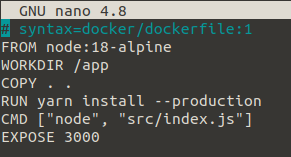
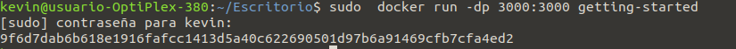

# Docker desde 0
Primero creamos un archivo vacio Dockerfile `touche Dockerfile`

Luego creamos una hija de texto con el Dockerfile yo lo he creado con `sudo nano Dockerfile`

Crear la imagen del contenedor 
> docker build -t getting-started .

El `docker build` comando usa Dockerfile para crear una nueva imagen de contenedor. Es posible que haya notado que Docker descargó muchas "capas". Esto se debe a que le indicó al constructor que deseaba comenzar desde la `node:18-alpine` imagen. Pero, dado que no tenía eso en su máquina, Docker necesitaba descargar la imagen.

Después de que Docker descargó la imagen, las instrucciones del Dockerfile se copiaron en su aplicación y se usaron `yarn` para instalar las dependencias de su aplicación. La `CMD` directiva especifica el comando predeterminado que se ejecutará al iniciar un contenedor desde esta imagen.

Finalmente, la `-t` bandera etiqueta tu imagen. Piense en esto simplemente como un nombre legible por humanos para la imagen final. Dado que nombró la imagen `getting-started`, puede hacer referencia a esa imagen cuando ejecuta un contenedor.

El  . al final del `docker build` comando le dice a Docker que debe buscar `Dockerfile` en el directorio actual.

Una vez creado el Docker lo tendremos que ejecutar con el comando `docker run -dp 3000:3000 getting-started`

